<picture>
  <source media="(prefers-color-scheme: dark)"  srcset="./assets/header-dark.svg">
  <source media="(prefers-color-scheme: light)" srcset="./assets/header-light.svg">
  
</picture>

 

---

İstanbul'da yazılım geliştiriyorum. Elektrik-elektronik mühendisliği geçmişim var;
bugün üç tarafta çalışıyorum: **Flutter** ile mobil, **NestJS/Node.js** ile arka uç,
**Next.js/React** ile web.

Son dönemde en çok vakit geçirdiğim yer gerçek zamanlı sistemler — WebSocket,
Redis tabanlı dağıtık durum yönetimi, çok bölgeli dağıtım.

> **Şu an:** Freewill Studio'da küresel bir canlı yayın platformunun arka uç
> altyapısında — NestJS + Clean Architecture, Redis Sentinel ile devralma,
> Agora Cloud Recording, Cloudflare R2/CDN.

 

## Kullandıklarım

<picture>
  <source media="(prefers-color-scheme: dark)"  srcset="https://skillicons.dev/icons?i=flutter,dart,ts,nestjs,nodejs,nextjs,react&theme=dark">
  <source media="(prefers-color-scheme: light)" srcset="https://skillicons.dev/icons?i=flutter,dart,ts,nestjs,nodejs,nextjs,react&theme=light">
  
</picture>
 
<picture>
  <source media="(prefers-color-scheme: dark)"  srcset="https://skillicons.dev/icons?i=redis,mongodb,socketio,docker,cloudflare,go,firebase&theme=dark">
  <source media="(prefers-color-scheme: light)" srcset="https://skillicons.dev/icons?i=redis,mongodb,socketio,docker,cloudflare,go,firebase&theme=light">
  
</picture>

 

## Seçilmiş işler

| | |
|---|---|
| [**peopler**](https://github.com/berkeugur/peopler) | Aynı ortamdaki insanların takma kimlikle tanışmasını sağlayan iOS uygulaması. Dört kişilik ekiple kurduk, App Store'a çıkardık. Mobil tarafı ben yazdım — Flutter, 317 commit. Sonlandırıldı, kaynak açık. |
| [**backdart**](https://github.com/berkeugur/backdart) | Dart ile arka uç denemesi. |
| [**cotable**](https://github.com/berkeugur/cotable) | TanStack tabanlı React tablo kütüphanesi. TypeScript. |
| [**PlateNumberExtractorLibrary**](https://github.com/berkeugur/PlateNumberExtractorLibrary) | base64 görüntülerden plaka numarası çıkaran .NET kütüphanesi, OpenAI API üzerinden. |

Daha fazlası ve yazdıklarım: **[berkeugur.com](https://berkeugur.com)**

 

## GitHub'da

<picture>
  <source media="(prefers-color-scheme: dark)"  srcset="./assets/stats-dark.svg">
  <source media="(prefers-color-scheme: light)" srcset="./assets/stats-light.svg">
  
</picture>
<picture>
  <source media="(prefers-color-scheme: dark)"  srcset="./assets/langs-dark.svg">
  <source media="(prefers-color-scheme: light)" srcset="./assets/langs-light.svg">
  
</picture>

Kartlar <code>scripts/gen_cards.py</code> ile GitHub API'sinden üretiliyor — hazır kart servisine bağlı değil.

  

<picture>
  <source media="(prefers-color-scheme: dark)"  srcset="https://streak-stats.demolab.com?user=berkeugur&background=0B0906&border=4A3A14&stroke=4A3A14&ring=FFB000&fire=FFB000&currStreakLabel=FFB000&currStreakNum=EDE6D8&sideLabels=EDE6D8&sideNums=EDE6D8&dates=9E9486&border_radius=2">
  <source media="(prefers-color-scheme: light)" srcset="https://streak-stats.demolab.com?user=berkeugur&background=F6F1E6&border=1A1712&stroke=1A1712&ring=B4520A&fire=B4520A&currStreakLabel=B4520A&currStreakNum=1A1712&sideLabels=1A1712&sideNums=1A1712&dates=6B6255&border_radius=2">
  
</picture>

 

## Katkı yılanı

<picture>
  <source media="(prefers-color-scheme: dark)"  srcset="https://raw.githubusercontent.com/berkeugur/berkeugur/output/snake-dark.svg">
  <source media="(prefers-color-scheme: light)" srcset="https://raw.githubusercontent.com/berkeugur/berkeugur/output/snake-light.svg">
  
</picture>

<code>whoami</code> · İstanbul · <a href="https://berkeugur.com">berkeugur.com</a>

